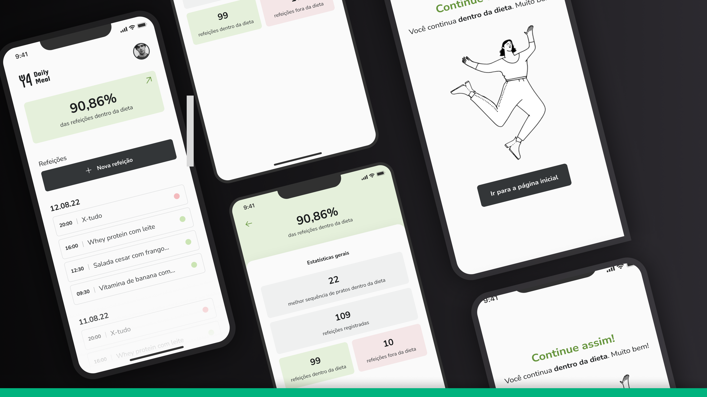

# Daily Diet App

## Sobre o projeto

O Daily Diet App é uma aplicação desenvolvida durante o segundo desafio da trilha de React Native do Ignite. O objetivo do aplicativo é permitir aos usuários registrar suas refeições diárias, monitorar seu progresso na dieta e realizar ações como adicionar, editar e remover refeições.

## Funcionalidades

- Adicionar uma nova refeição
- Editar uma refeição existente
- Remover uma refeição da listagem
- Visualizar estatísticas do progresso da dieta
- Navegação entre telas em pilha
- Armazenamento local das refeições utilizando AsyncStorage

## Como executar o projeto

1. Clone este repositório:

```bash
git clone https://github.com/seu-usuario/daily-diet-app.git
```

2. Instale as dependências:

```bash
cd daily-diet-app
npm install
# ou
yarn install
```

3. Execute o projeto no emulador ou dispositivo físico:

```bash
npm start
# ou
yarn start
```

4. Para buildar o aplicativo para produção:

```bash
npm run android
# ou
npm run ios
```

## Tecnologias utilizadas

- React Native
- React Navigation
- AsyncStorage
- Styled Components

## Layout

O layout do aplicativo foi desenvolvido utilizando o Figma e pode ser acessado [aqui](link_para_o_layout_no_figma).

## Contribuindo

Contribuições são bem-vindas! Para sugestões, correções de bugs ou melhorias, sinta-se à vontade para abrir uma issue ou criar um pull request.

## Licença

Este projeto está licenciado sob a Licença MIT. Consulte o arquivo [LICENSE](link_para_o_arquivo_license) para obter mais informações.

---
